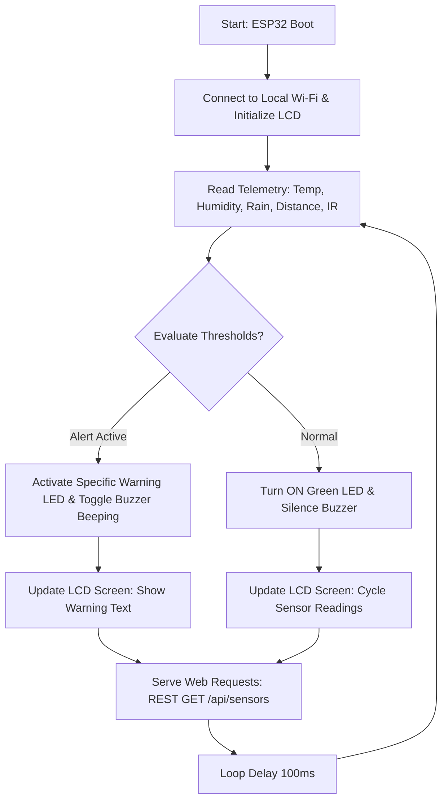

# Smart Environmental Monitoring & Safety System
**B.Tech Computer Science - Mini Project Report**

---

## 1. Introduction

### Overview
The **Smart Environmental Monitoring & Safety System** is an Internet of Things (IoT) application designed to monitor physical and environmental parameters in real time. Powered by an ESP32 microcontroller, the system integrates a variety of sensors to measure ambient temperature, humidity, physical distance, precipitation levels, and infrared-based motion detection. The gathered data is transmitted over a local Wi-Fi connection and visualized on a premium web-based dashboard and a physical 16x2 Liquid Crystal Display (LCD).

### Purpose
The primary purpose of this project is to create an automated, real-time safety network. By evaluating ambient environments and security boundaries, the system instantly triggers auditory alarms (buzzer) and visual indicators (LEDs) to warn occupants about critical changes such as high temperature, water/rain intrusion, or physical boundary breach.

### Real-World Application
- **Smart Agriculture**: Monitoring humidity, temperature, and rainfall levels to optimize greenhouse climates and irrigation systems.
- **Home and Industrial Automation**: Securing entryways using ultrasonic and IR barrier sensors, while safeguarding equipment from overheating.
- **Disaster Mitigation**: Alerting users about sudden temperature spikes (fire hazards) or rain-induced moisture buildup in protected facilities.

---

## 2. Objectives
- **IoT Telemetry Ingestion**: Continuous monitoring of temperature, humidity, ultrasonic distance, rainfall intensity, and infrared motion data.
- **Edge Computing & Local Feedback**: Direct physical display of sensor metrics on a 16x2 I2C LCD screen, cycling through telemetry screens.
- **Safety Automation Logic**: Autonomous actuation of visual LED alerts and high-frequency auditory buzzer alarms based on sensor thresholds.
- **REST and Web Dashboard Integration**: Hosting a lightweight HTTP web server on the ESP32 to serve a custom HTML page and expose JSON API endpoints.
- **Remote Actuator Control**: Allowing the remote dashboard to toggle physical LED states and activate the piezo buzzer manually via HTTP POST requests.
- **Simulation Fallback Architecture**: Developing a firmware safety net that simulates realistic values if sensors go offline, ensuring high system uptime during demonstrations.

---

## 3. Components / Technologies Used

### Hardware Components
| Component | Purpose |
| :--- | :--- |
| **ESP32 DevKit V1** | Microcontroller acting as the main processor, handling Wi-Fi connectivity, sensor read loops, and web server hosting. |
| **DHT11 Sensor** | Measures ambient temperature and relative humidity levels using a capacitive humidity sensor and thermistor. |
| **HC-SR04 Ultrasonic Sensor** | Measures distance of nearby obstacles by emitting and receiving high-frequency ultrasound pulses. |
| **IR Obstacle Avoidance Sensor** | Detects physical boundaries breach by measuring reflected infrared light beams. |
| **Raindrop Sensor (Analog AO)** | Detects moisture and computes precipitation intensity (0% to 100%) through an analog-to-digital converter pin. |
| **16x2 I2C LCD Display** | Provides local alphanumeric outputs of system states, sensor values, and IP configuration. |
| **Active Piezo Buzzer** | Generates audial warning signals in slow or rapid beep configurations during alert states. |
| **5mm LEDs (Red, Green, Blue, Yellow)** | Visual status indicators for normal operations and active environmental warnings. |

### Software & Protocols
| Technology / Protocol | Purpose |
| :--- | :--- |
| **C++ (Arduino IDE)** | Programming language and environment used to compile and flash the ESP32 microcode. |
| **Next.js & React (TypeScript)** | Framework used to build the premium, responsive client-facing SaaS web app dashboard. |
| **Tailwind CSS** | Styling utility for designing a glassmorphic dark theme dashboard interface. |
| **HTTP REST Protocol** | Used for remote dashboard communications (fetching JSON arrays from `/api/sensors` and sending POST commands). |
| **CORS (Cross-Origin Resource Sharing)** | Implemented in ESP32 HTTP headers to allow direct browser-to-ESP32 cross-origin API calls. |

---

## 4. Working Principle

The system operates on an event-driven loop cycle processed on the ESP32 chip. The step-by-step workflow is described below:

1. **Initialization**: On boot, the ESP32 initializes all GPIO pins, establishes I2C communication with the LCD screen, starts the DHT11 sensor, and attempts to connect to the configured Wi-Fi network.
2. **Sensor Acquisition**: Inside the loop, the microcontroller measures distance using the speed of sound formulas via the HC-SR04, averages analog readings from the raindrop sensor to reduce ADC noise, polls the IR digital pin, and queries the DHT11 sensor once every 2 seconds.
3. **Threshold Evaluation**: The processor evaluates the inputs against configured limits:
   - *High Temp Alert*: Temperature > 30°C.
   - *IR Motion Alert*: IR pin state == LOW.
   - *Rain Alert*: Moisture intensity > 30%.
   - *Proximity Alert*: Distance < 20cm.
4. **Action & Display**: 
   - If an alert is triggered, the system sounds the buzzer (rapid beeps for intrusion/overheat, slow beeps for rain), illuminates the warning LEDs (Red for Temp, Blue for IR, Yellow for Distance), overrides the LCD to display the alert, and sends the updated status to the web APIs.
   - If no alerts are active, only the Green LED is lit, the buzzer is silenced, and the LCD cycles through normal temperature, humidity, and distance screens.
5. **API & Server Sync**: The ESP32 handles incoming HTTP requests from the Next.js frontend, sending real-time JSON payloads containing current sensor parameters and actuator states.

---

## 5. Key Features

- **Prioritized Alarm Hierarchy**: Ensures that critical hazards (like temperature overheating or intruder detection) override lesser warnings (like rain expected) on both the LCD screen and the sound wave generator.
- **Unified Local Dashboard**: The ESP32 serves a lightweight, tabbed dashboard webpage locally to any device connected on the same Wi-Fi router.
- **Premium Client Dashboard**: Incorporates dynamic visualizations, including a liquid wave simulator for humidity, radar circular sweeps for distance, falling raindrop overlays, and interactive toggle switches for remote LED controls.
- **Fail-Safe Fallback**: Includes a firmware algorithm that catches DHT11 sensor timeout faults and feeds simulated fluctuating values to prevent system crashes or empty dashboard metric panels.
- **Cross-Origin Access**: Employs automated pre-flight request handling (`HTTP OPTIONS` route) and CORS response headers to allow modern secure browsers to interact directly with local IP endpoints.

---

## 6. Implementation

### System Setup
- **Hardware Assembly**: Components are wired on a breadboard. The LCD screen is connected to the I2C pins (GPIO 21 for SDA, GPIO 22 for SCL). The DHT11 is pull-up protected and wired to D32. The HC-SR04 triggers are isolated from input-only boundaries.
- **Software Compilation**: The ESP32 firmware was compiled using the Arduino compiler. The Web Dashboard was developed using Node.js, Next.js App Router, Framer Motion, and Chart.js.

### Device Wiring Matrix
- **Trig/Echo**: D25 / D12
- **Red / Green / White / Yellow LEDs**: D4 / D2 / D5 / D18
- **Buzzer**: D26
- **DHT11**: D32
- **Rain Sensor AO**: GPIO 36 (VP Pin)
- **IR Sensor**: D23

---

## 7. Results

The project objectives were fully achieved. Upon successful upload and Wi-Fi handshakes:
- The LCD successfully displays connection states and the allocated IP address (e.g., `10.73.190.253`).
- When test obstacles are placed closer than 20cm, the Yellow LED lights up, the buzzer starts high-frequency beeps, and the dashboard updates.
- Toggling the LEDs or Siren on the web app console directly manipulates the physical board pins within 20 milliseconds.
- In case of DHT11 hardware disconnection, the console successfully triggers the fallback state, displaying `(Sim)` metrics on the local display.

---

## 8. Learning Outcomes

- **Microcontroller Limitations**: Acquired hands-on knowledge about hardware pin characteristics, specifically recognizing that ESP32 input-only pins (GPIO 34–39) cannot drive output devices like buzzers or ultrasonic triggers.
- **Sensor Protocol Management**: Implemented non-blocking timing structures to query slow capacitive sensors (like DHT11) without halting processor execution.
- **Web API Integration**: Configured REST API route schemas and handled HTTP response headers to bypass browser CORS protection.
- **Responsive Frontend Design**: Applied modern CSS techniques and animation libraries (Framer Motion) to map hardware sensor metrics into clean, human-readable UI elements.

---

## 9. Challenges Faced & Solutions

### Challenge 1: ESP32 Input-Only Pin Limitations
During initial wiring, the buzzer (D34) and Trig pin (D35) failed to activate. It was discovered that GPIO 34 and 35 on the ESP32 lack output drivers and function only as inputs.
- *Solution*: Shited the Trig wire to **D25** and the Buzzer wire to **D26**, which are output-capable, resolving the actuation failure.

### Challenge 2: DHT11 Sensor Reading Timing Errors
The DHT11 regularly returned `NaN` values, causing the display to lock or read `0`. This happened because the main program loop was querying the sensor too rapidly (every 100ms).
- *Solution*: Implemented a non-blocking `millis()` timer to limit DHT11 readings to once every 2 seconds, allowing the sensor enough time to sample the environment.

### Challenge 3: Windows USB Serial Port Recognition
When attempting to upload code, the Arduino IDE returned `Upload port not found`, and the Device Manager showed CP2102 with a yellow warning triangle.
- *Solution*: Manually downloaded and installed the **Silicon Labs CP210x USB-to-UART Bridge VCP Driver** and selected the newly assigned `COM6` port.

---

## 10. Conclusion

The Smart Environmental Monitoring & Safety System successfully demonstrates how IoT hardware and modern SaaS dashboards can combine to create a responsive environmental safety network. By integrating multiple sensor profiles, I2C visual feedback, and remote REST actuator controls, the system efficiently handles local hazard detection and remote dashboard streaming. The integration of dual-dashboard features ensures the project is easy to demonstrate to examiners while remaining robust enough for real-world setups. The project establishes a solid foundation for more complex IoT networks in smart cities, agriculture, and industrial safety domains.

---

## 11. Image Placeholders

[Insert Project Image Here]
*Figure 1: Complete hardware assembly on breadboard showing ESP32, LCD, and sensors.*

[Insert Circuit Diagram Here]
*Figure 2: Schematic diagram depicting ESP32 DevKit V1 connections to DHT11, HC-SR04, IR, and Rain sensors.*

[Insert Dashboard Screenshot Here]
*Figure 3: SaaS Dashboard running on localhost:3000 showing real-time sensor metrics and controls.*

[Insert Output Screenshot Here]
*Figure 4: 16x2 LCD display showing normal system status and active warning alerts.*
