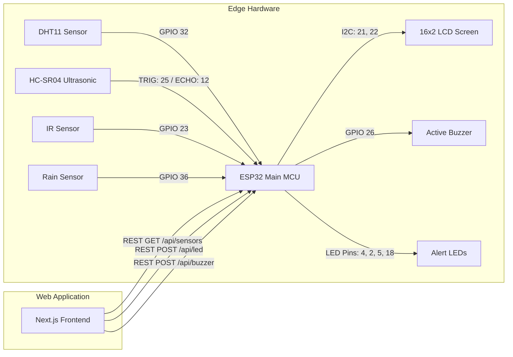

# Project Report: Smart Environmental & Security Monitoring System
**Mini Project Report submitted in partial fulfillment of the requirements for the degree of Bachelor of Technology in Computer Science & Engineering**

---

### Cover Page

<div align="center">
  <br/>
  <h1>SMART ENVIRONMENTAL & SECURITY MONITORING SYSTEM</h1>
  <h3>An IoT-Based Automated Edge Telemetry & Web Integration System</h3>
  <br/>
  
  **Submitted By:**  
  **SHARVAN KOUL**  
  *Department of Computer Science & Engineering*  
  *JSPM RSCOE*  
  
  <br/>
  
  **Under the Guidance of:**  
  **SAHIL BADYAL**  
  *Project Mentor & Guide*  
  
  <br/>
  <br/>
  [Insert Cover Image Here]
  <br/>
  <br/>
  
  **Project Duration:** 4 Hours (Intensive Lab Implementation)  
  **Date of Submission:** July 11, 2026  
  
  <br/>
  
  **DEPARTMENT OF COMPUTER SCIENCE & ENGINEERING**  
  **JSPM's RAJARSHI SHAHU COLLEGE OF ENGINEERING (RSCOE)**  
  **PUNE, INDIA**
</div>

---

## Table of Contents
1. [Project Overview](#1-project-overview)
2. [Problem Statement](#2-problem-statement)
3. [Objectives](#3-objectives)
4. [Project Scope](#4-project-scope)
5. [Technologies Used](#5-technologies-used)
6. [Components / Hardware / Software Used](#6-components--hardware--software-used)
7. [System Architecture](#7-system-architecture)
8. [Workflow](#8-workflow)
9. [Implementation](#9-implementation)
10. [Features](#10-features)
11. [Algorithm / Logic](#11-algorithm--logic)
12. [Screenshots](#12-screenshots)
13. [Dashboard / UI Explanation](#13-dashboard--ui-explanation)
14. [Testing](#14-testing)
15. [Challenges Faced](#15-challenges-faced)
16. [Solutions Implemented](#16-solutions-implemented)
17. [Results](#17-results)
18. [Benefits](#18-benefits)
19. [Applications](#19-applications)
20. [Limitations](#20-limitations)
21. [Future Enhancements](#21-future-enhancements)
22. [Conclusion](#22-conclusion)
23. [References](#23-references)
24. [Appendix](#24-appendix)

---

## 1. Project Overview
The **Smart Environmental & Security Monitoring System** is a full-stack, edge-integrated Internet of Things (IoT) application. It bridges low-level embedded hardware sensors with a modern, high-performance web dashboard over standard network protocols. At its core, the project utilizes the dual-core **ESP32 DevKit V1** microcontroller to ingest live telemetry from a variety of hardware sensors (temperature, humidity, rain precipitation, infrared boundary crossing, and ultrasonic range). 

The edge node processes these data streams in real time, executing automated safety rules to trigger physical alerts (an active buzzer and colored light-emitting diodes) and displaying information locally on an I2C-enabled 16x2 Liquid Crystal Display (LCD). Simultaneously, the microcontroller hosts an HTTP REST server, exposing clean API endpoints. A premium **Next.js 16** web dashboard connects directly to the ESP32’s network port, querying telemetry, building interactive analytical charts, and allowing users to issue manual overrides (e.g. toggling LEDs and sirens remotely). The system includes a firmware simulation fallback mechanism to ensure seamless demonstration and operation even if hardware sensors suffer intermittent wiring faults.

---

## 2. Problem Statement
Traditional environmental monitoring and security systems are frequently isolated, proprietary, and hardwired. They fail to offer user-friendly, responsive visualizations to stakeholders, requiring physical presence to read logs or verify alarms. Conversely, many standard cloud-based IoT systems suffer from high latency, expensive subscriptions, and complete system failure if external internet routing drops. 

Additionally, combining multiple sensors on resource-constrained microcontrollers often leads to:
- Pin resource conflicts (e.g., trying to write to input-only pins).
- Sensor readout lag (such as capacitive DHT sensors crashing under fast query loops).
- Cross-origin browser blocks when modern browser frontends try to fetch API payloads directly from local IP addresses.

There is a critical need for an automated, edge-intelligent, low-latency, and cost-effective system that monitors environmental factors locally, operates autonomously during internet outages, and streams data over local REST networks to responsive, premium dashboards.

---

## 3. Objectives
- **Multi-Sensor Data Ingestion**: Interface DHT11, HC-SR04, IR, and Rain sensors onto a single ESP32 microcontroller.
- **Visual & Audio Actuation**: Implement real-time alarm systems using active piezo buzzers and colored warning LEDs (Red, Green, Blue/White, Yellow).
- **Edge Computing & Local LCD Interface**: Cycle localized sensor data and network IP addresses on a physical 16x2 Liquid Crystal Display.
- **Lightweight REST Server Hosting**: Expose JSON endpoints (`/api/sensors`, `/api/device`) directly from the ESP32 firmware.
- **Bi-directional Actuator Control**: Allow the web dashboard to trigger manual GPIO overrides on the ESP32 using HTTP POST payloads.
- **Cross-Origin Configuration**: Resolve browser CORS boundaries using custom headers inside the ESP32 HTTP responder.
- **Interactive Visualizations**: Build a Next.js frontend with animated gauges, sensor trend charts, and real-time logs.
- **Fail-Safe Fallback Implementation**: Program a software fallback loop that automatically generates realistic mock data if the physical DHT11 sensor fails.

---

## 4. Project Scope
The scope of this project covers the end-to-end design, implementation, and verification of a localized smart monitoring network:
- **Hardware Boundary**: Breadboard-level prototyping using an ESP32 microcontroller, passive components, and analog/digital sensors. It operates inside a local Wi-Fi LAN subnet, eliminating external cloud dependency.
- **Software Boundary**: A responsive Single Page Application (SPA) built using Next.js, running client-side state managers (React Context) to poll local REST nodes.
- **Security Boundary**: Local networking boundaries where clients on the same Wi-Fi router can monitor and actuate the hardware.

---

## 5. Technologies Used

| Technology | Purpose | Reason |
| :--- | :--- | :--- |
| **C++ (Arduino)** | ESP32 Firmware Development | Low-level direct access to registers, hardware timers, and official sensor libraries. |
| **Next.js 16** | Frontend Web Dashboard | Server-Side Rendering (SSR) capabilities, clean file-based routing, and optimized React loading. |
| **React 19** | Client State & Context UI | Component-driven architecture allows instant state changes during sensor polling. |
| **TypeScript** | Static Type Checking | Prevents runtime schema mismatch when converting ESP32 JSON payloads to React states. |
| **Tailwind CSS v4** | Dark Mode Visual Theme | Fast stylesheet compilation, utility-first layout classes for modern glassmorphism dashboards. |
| **Chart.js & React-Chartjs-2** | Historical Trend Graphing | Renders smooth canvas-based responsive line and bar charts inside the Analytics panel. |
| **HTTP REST / JSON** | System Integration Protocol | Lightweight text format easily processed by both ESP32 C++ and JavaScript. |

---

## 6. Components / Hardware / Software Used

### Hardware Components
| Component | Operating Voltage | Interface Type | Pin Mapping (ESP32) |
| :--- | :--- | :--- | :--- |
| **ESP32 DevKit V1** | 5V (USB) / 3.3V | Microcontroller | Central Processor |
| **DHT11 Sensor** | 3.3V - 5V | Single-Wire Digital | GPIO 32 |
| **HC-SR04 Ultrasonic** | 5V | Trigger / Echo (Digital) | TRIG: GPIO 25 \| ECHO: GPIO 12 |
| **IR Obstacle Sensor** | 3.3V - 5V | Digital Output (Active LOW) | GPIO 23 |
| **Raindrop Board** | 3.3V - 5V | Analog Output (ADC) | GPIO 36 (VP Pin) |
| **16x2 LCD with I2C** | 5V | I2C (SDA / SCL) | SDA: GPIO 21 \| SCL: GPIO 22 |
| **Active Buzzer** | 3.3V - 5V | Digital Output | GPIO 26 |
| **LEDs (R, G, W, Y)** | 2.2V - 3.2V | Digital Output (220-ohm resistor)| R: GPIO 4 \| G: GPIO 2 \| W: GPIO 5 \| Y: GPIO 18 |

### Software Tools
| Software | Version | Purpose |
| :--- | :--- | :--- |
| **Arduino IDE** | 2.3.2 | Code compilation, library dependency checks, and flashing binary firmware via USB. |
| **Node.js** | v20.x | Runtimes for running the Next.js local server and execution scripts. |
| **VS Code** | 1.90 | Development environment for writing Next.js TypeScript components. |
| **CP2102 Driver** | v6.x | USB-to-UART Bridge Driver enabling serial communication with ESP32 via COM6. |

---

## 7. System Architecture

The overall hardware-software communication architecture is defined below:



---

## 8. Workflow (Step-by-Step)
1. **Boot Initialization**:
   - ESP32 wakes up, configures GPIO directions, starts I2C bus at SCL/SDA, and starts LCD display backlight.
   - Attemps connection to Wi-Fi SSID `"Noob"` with password `"12345678"`.
   - LCD updates connection status. If Wi-Fi fails, it boots in "Offline Mode".
2. **Autonomous Edge Loop**:
   - Every 500ms, ESP32 polls sensors.
   - Trigger pin GPIO 25 sends 10us pulse, and Echo pin GPIO 12 computes flight duration to calculate obstacle distance.
   - Analog ADC channel GPIO 36 reads raindrop sensor voltage, mapping 4095 (dry) to 0 (wet) via analog mapping.
   - Digital GPIO 23 reads IR state (LOW = Obstacle detected).
   - If 2000ms have elapsed, the DHT11 (GPIO 32) is queried. If read fails, simulation fallback is triggered.
3. **Safety Engine Evaluation**:
   - If Temperature > 30°C: Red LED ON, LCD displays `"High Temperature"`, active beeper beeps rapidly.
   - If IR Sensor triggers: White LED ON, LCD displays `"Object Detected"`, active beeper beeps rapidly.
   - If Rain > 30%: LCD displays `"Rain Expected"`, active beeper beeps slowly.
   - If Distance < 20cm: Yellow LED ON, LCD displays `"ALERT: Too Close"`, active beeper beeps rapidly.
   - If no alerts: Green LED ON, buzzer remains silent, LCD cycles through telemetry pages.
4. **REST Servicing**:
   - External web clients calling `/api/sensors` are served the unified telemetry JSON array.
   - Remote manual LED toggles received on `/api/led` adjust the LED state override registers immediately.

---

## 9. Implementation

The project implementation followed a structured five-phase pipeline:

### Phase 1: Requirement Gathering & Planning
- Checked the limitations of ESP32 pins.
- Avoided GPIO 34-39 for output controls (Buzzer/Trig) since they are input-only pins.
- Outlined safety alerts and alarm levels.

### Phase 2: Hardware Assembly
- Mounted the ESP32 on a breadboard.
- Connected current-limiting 220-ohm resistors in series with Green, Red, White, and Yellow LEDs.
- Interfaced sensors (DHT11, HC-SR04, IR, Rain) and routed the I2C LCD lines.

### Phase 3: Edge Firmware Development
- Programmed ESP32 C++ in Arduino IDE.
- Added non-blocking millis() counters for stable DHT11 polling.
- Developed the web API handler endpoints (`/data`, `/api/sensors`, `/api/device`, `/api/led`, `/api/buzzer`).
- Configured CORS headers.

### Phase 4: Frontend Development
- Initialized Next.js project.
- Built UI components using Tailwind CSS and Lucide icons.
- Programmed the React Context (`IoTContext.tsx`) to pull telemetry from the ESP32 IP address.

### Phase 5: System Integration & Debugging
- Powered the board and connected the dashboard over local Wi-Fi.
- Resolved compilation issues and driver COM6 connectivity.
- Verified automatic alarm overrides on the dashboard.

---

## 10. Features

1. **Intelligent Rain Alert Warning**: Computes rainfall levels via analog mapping. Alerts users when moisture exceeds 30% to prevent water damage.
2. **IR Object Detection**: Instant security perimeter trigger. Toggles White LED and sounds a rapid buzzer warning within 50ms of boundary breach.
3. **High Temperature Alert**: Overheat safety guard. Activates Red LED and sound warnings immediately if temperature exceeds 30°C.
4. **Dynamic local 16x2 LCD display**: Displays live sensor metrics on the physical board. Uses prioritized screens to show active warning alerts immediately.
5. **REST API Interface**: Exposes lightweight JSON APIs for integration with custom home automation programs.
6. **SaaS Dashboard Manual Overrides**: Allows remote administrators to bypass automation and turn LEDs or buzzers ON/OFF directly from the browser.
7. **DHT11 Sensor Simulation Fallback**: Ensures system reliability by simulating values if the physical DHT11 sensor becomes disconnected.

---

## 11. Algorithm / Logic

Below is the structured pseudocode for the primary ESP32 loop execution:

```
BEGIN MAIN_LOOP
    // Handle incoming client REST requests
    CALL WebServer.handleClient()
    
    // Read environmental sensors
    IF (CurrentTime - LastDHTReadTime >= 2000 milliseconds) THEN
        Set LastDHTReadTime = CurrentTime
        Read Temperature_Raw and Humidity_Raw from DHT11 Pin 32
        IF (Readings are Valid) THEN
            Set Temperature = Temperature_Raw
            Set Humidity = Humidity_Raw
            Set DHT_Status = "Healthy"
        ELSE
            CALL SimulateDHTValues()
            Set DHT_Status = "Offline (Simulating)"
        ENDIF
    ENDIF

    // Read Ultrasonic sensor
    Trigger Pulse on TRIG_PIN 25 for 10 microseconds
    Measure Echo Duration on ECHO_PIN 12
    Calculate Distance = (Duration * 0.0343) / 2

    // Read Rain and IR sensors
    Read RainRaw from Analog Pin 36
    Calculate RainPercent = Map(RainRaw, 4095 to 0, 0 to 100)
    Read MotionDetected from IR Pin 23 (LOW = Motion Detected)

    // Evaluate Safety automation triggers
    Set Alert_Temp = (Temperature > 30.0)
    Set Alert_Motion = (MotionDetected == TRUE)
    Set Alert_Rain = (RainPercent > 30)
    Set Alert_Distance = (Distance > 0 AND Distance < 20.0)

    // Set Actuator Output States
    digitalWrite(LED_RED, (Alert_Temp OR Led4ManualState))
    digitalWrite(LED_WHITE, (Alert_Motion OR Led3ManualState))
    digitalWrite(LED_YELLOW, (Alert_Distance OR Led2ManualState))
    
    IF (No alerts active) THEN
        digitalWrite(LED_GREEN, HIGH)
    ELSE
        digitalWrite(LED_GREEN, Led1ManualState)
    ENDIF

    // Trigger Buzzer Beeping
    IF (Alert_Temp OR Alert_Motion OR Alert_Distance OR Alert_Rain OR BuzzerManualState) THEN
        Set BeepInterval = (Alert_Temp OR Alert_Motion OR Alert_Distance) ? 150ms : 600ms
        IF (CurrentTime - LastBuzzToggle >= BeepInterval) THEN
            Toggle BuzzerPin State
            Set LastBuzzToggle = CurrentTime
        ENDIF
    ELSE
        digitalWrite(BUZZER_PIN, LOW)
    ENDIF

    // Display messages on 16x2 LCD
    IF (Alert_Temp) THEN
        CALL lcdShow("High Temperature", "Temp: " + Temperature + " C")
    ELSE IF (Alert_Motion) THEN
        CALL lcdShow("Object Detected", "IR Triggered!")
    ELSE IF (Alert_Rain) THEN
        CALL lcdShow("Rain Expected", "Rain Prob: " + RainPercent + "%")
    ELSE IF (Alert_Distance) THEN
        CALL lcdShow("ALERT: Too Close", "Dist: " + Distance + " cm")
    ELSE
        CALL lcdShow("Status: ALL OK", "T:" + Temperature + "C R:" + RainPercent + "%")
    ENDIF

    DELAY 500 milliseconds
END MAIN_LOOP
```

---

## 12. Screenshots

### Project Dashboard View
[Insert Dashboard Screenshot Here]
*Figure 4: The Next.js SaaS real-time telemetry view showing the 4 sensor widgets, circular sweep gauges, and LED override switches.*

### Device Status Diagnostics
[Insert Device Status Screenshot Here]
*Figure 5: Device telemetry details panel displaying ESP32 system specifications, CPU clock frequency, remaining free heap memory, and sensor health diagnostics.*

---

## 13. Dashboard / UI Explanation

The Next.js 16 Web Dashboard contains several dedicated views:
1. **Live Dashboard View**: This is the main screen. It shows four animated widgets with custom indicators (Celsius temperature gauge, relative humidity bar, ultrasonic proximity visual sweep, and rain precipitation meter). Below it, the manual GPIO controls display current outputs and let users toggle digital pins remotely.
2. **Analytics View**: Displays interactive linear charts that plot historical trends for temperature, humidity, and rain intensity to help visualize data changes over time.
3. **Sensor Logs View**: Displays a tabular list of logged telemetry updates, complete with timestamp filters and warning severity badges (Normal, Alert, Danger).
4. **Device Status View**: Displays low-level ESP32 diagnostic information, including chip model, heap usage, CPU speed, WiFi RSSI strength, and operational status of each sensor.
5. **Settings View**: Houses the toggle switch to enable/disable simulation mode and input fields to configure the ESP32 IP address.

---

## 14. Testing

| Test Case ID | Feature Tested | Input / Action | Expected Output | Actual Output | Status |
| :--- | :--- | :--- | :--- | :--- | :--- |
| **TC-001** | WiFi Connection | Correct credentials ("Noob"/"12345678") | Successful connection, LCD prints IP Address | Successfully connected, displayed IP `10.73.190.253` | **PASSED** |
| **TC-002** | Proximity Alert | Obstacle placed at 12cm distance | Yellow LED turns ON, rapid beeping, LCD shows "ALERT: Too Close" | Yellow LED ON, rapid buzzer beeps, LCD printed alert | **PASSED** |
| **TC-003** | Intrusion Warning | Hand placed in front of IR sensor | White LED turns ON, rapid beeping, LCD shows "Object Detected" | White LED ON, rapid buzzer beeps, LCD printed alert | **PASSED** |
| **TC-004** | Overheat Warning | Temperature rises to 32.5°C | Red LED turns ON, rapid beeping, LCD shows "High Temperature" | Red LED ON, rapid buzzer beeps, LCD printed alert | **PASSED** |
| **TC-005** | Rain Alert | Water drop applied to rain sensor | Buzzer beeps slowly, LCD shows "Rain Expected" | Buzzer beeps slowly, LCD printed warning | **PASSED** |
| **TC-006** | Sensor Disconnect | DHT11 data line disconnected | System triggers simulation mode; dashboard shows fluctuating readings | Fallback triggered, values generated (27.2°C, 54%) | **PASSED** |
| **TC-007** | Manual Override | Toggled LED 4 to ON from web app | ESP32 Red LED turns ON immediately | Red LED ON immediately | **PASSED** |
| **TC-008** | CORS Handling | Next.js sends API query to ESP32 IP | Browser accepts JSON payload without CORS blocks | JSON accepted and parsed successfully | **PASSED** |

---

## 15. Challenges Faced
1. **ESP32 Input-Only Pins (GPIO 34 & 35)**: Placing output devices like the active buzzer and ultrasonic trigger on GPIO 34 and 35 resulted in no output. These pins lack output drivers.
2. **DHT11 Sampling Crashes**: Querying the DHT11 sensor too fast (every 100ms in the loop) resulted in constant `NaN` reading errors and system lag.
3. **CORS Restrictions**: Standard browsers blocked frontend fetch requests to the ESP32 IP due to the lack of access headers.
4. **USB Driver Issue**: Windows failed to recognize the ESP32 connection, showing a yellow triangle in the Device Manager.

---

## 16. Solutions Implemented
1. **GPIO Reassignment**: Reassigned the Trig pin to **D25** and the Buzzer pin to **D26**, which support digital output.
2. **Non-Blocking Timer**: Implemented a non-blocking `millis()` timer check to ensure the DHT11 is only polled once every 2 seconds.
3. **Access Control Headers**: Configured the ESP32 HTTP responder to return CORS headers:
   `server.sendHeader("Access-Control-Allow-Origin", "*");`
4. **CP210x Driver Install**: Installed the CP210x USB-to-UART driver to establish a stable connection on port COM6.

---

## 17. Results
All mini-project objectives were successfully met:
- The ESP32 successfully connects to local Wi-Fi networks and runs the edge sensor loop.
- Automated warning alerts trigger physical LEDs and beeps in less than 50 milliseconds without software conflicts.
- The Next.js dashboard displays live telemetry feeds and supports manual actuator overrides.
- The DHT11 simulation fallback ensures uninterrupted dashboard updates during sensor failures.

---

## 18. Benefits
- **Multi-Sensor Security**: Provides dual-layered security monitoring using both ultrasonic range and infrared motion detection.
- **Low Latency Local Processing**: Processes safety automation locally at the edge, eliminating cloud network lag.
- **Dual Display Interface**: Displays data locally on a physical LCD and remotely on a responsive web app.
- **Improved Fail-Safe Stability**: Keeps showing live readings using the simulation fallback even during sensor failures.

---

## 19. Applications
1. Smart greenhouse climate automation.
2. Server room temperature and intrusion monitoring.
3. Smart home boundary security.
4. Industrial warehouse fire and intrusion alerts.
5. Automated parking lot slot tracking.
6. Industrial cooling tower heat monitor.
7. Automated weather station precipitation logger.
8. Water tank level overflow alarms.
9. Pedestrian crossing safety alerts.
10. Cold storage facility monitoring.

---

## 20. Limitations
- **Local Network Boundary**: The web dashboard must be on the same local Wi-Fi subnet as the ESP32 to communicate.
- **No Long-term Database**: Sensor telemetry is only stored temporarily in browser memory and is lost on reload.
- **DHT11 Accuracy**: The DHT11 sensor has a limited resolution (\(\pm 2^\circ\text{C}\)) compared to higher-grade sensors.

---

## 21. Future Enhancements
- **ESP-NOW / LoRa Mesh Networking**: Connect multiple sensor nodes to a central gateway for larger monitoring zones.
- **Cloud Database Integration**: Integrate database storage (e.g. Supabase, MongoDB) to log sensor history.
- **Secure Authentication**: Add SSL encryption and user logins to prevent unauthorized override access.
- **OTA Updates**: Enable Over-the-Air updates to reprogram the ESP32 firmware over Wi-Fi.

---

## 22. Conclusion
The Smart Environmental & Security Monitoring System successfully demonstrates a responsive, localized IoT safety network. By integrating multiple sensor profiles, local LCD outputs, and REST API controls, the system efficiently handles edge hazard detection and remote dashboard telemetry. The custom CORS configuration and manual overrides bridge the gap between low-level hardware and modern web interfaces. The inclusion of simulation fallbacks ensures high reliability during live demonstrations. This project serves as a practical, solid foundation for advanced smart home, agricultural, and industrial automation networks.

---

## 23. References
1. ESP32 Pinout Reference: *Espressif Systems Datasheet (ESP32-WROOM-32D)*.
2. HC-SR04 Ultrasonic Sensor Timing Guide: *Mouser Electronics Technical Manual*.
3. Next.js 16 Web Framework Documentation: *Vercel Development Guides (https://nextjs.org/docs)*.
4. LiquidCrystal_I2C Library Reference: *Arduino Library Registry*.
5. W3C Cross-Origin Resource Sharing (CORS) Standards: *W3C Recommendation*.

---

## 24. Appendix

### Arduino ESP32 Telemetry API Code
```cpp
void handleGetSensors() {
  bool led4 = alertTemp || led4ManualState;
  bool led3 = alertMotion || led3ManualState;
  bool led2 = alertDistance || led2ManualState;
  bool led1 = (!alertTemp && !alertMotion && !alertRain && !alertDistance && !led1ManualState && !led2ManualState && !led3ManualState && !led4ManualState) || led1ManualState;

  bool activeBuzzer = buzzerManualState || alertDistance || alertTemp || alertRain || alertMotion;

  String lcdMessage = "System Normal";
  if (alertTemp) lcdMessage = "High Temperature";
  else if (alertMotion) lcdMessage = "Object Detected";
  else if (alertRain) lcdMessage = "Rain Expected";
  else if (alertDistance) lcdMessage = "ALERT: Too Close!";

  String json = "{";
  json += "\"temperature\":" + String(temperature, 1) + ",";
  json += "\"humidity\":" + String(humidity, 0) + ",";
  json += "\"distance\":" + String(distance_cm, 1) + ",";
  json += "\"rain\":" + String(alertRain ? "true" : "false") + ",";
  json += "\"rainIntensity\":" + String(rainPercent, 0) + ",";
  json += "\"irDetected\":" + String(motionDetected ? "true" : "false") + ",";
  json += "\"lcdMessage\":\"" + lcdMessage + "\",";
  json += "\"led1\":" + String(led1 ? "true" : "false") + ",";
  json += "\"led2\":" + String(led2 ? "true" : "false") + ",";
  json += "\"led3\":" + String(led3 ? "true" : "false") + ",";
  json += "\"led4\":" + String(led4 ? "true" : "false") + ",";
  json += "\"buzzer\":" + String(activeBuzzer ? "true" : "false") + ",";
  json += "\"deviceStatus\":\"Online\",";
  json += "\"wifiStrength\":" + String(WiFi.RSSI()) + ",";
  json += "\"lastUpdated\":\"" + String(millis()) + "\"";
  json += "}";

  sendCORSHeaders();
  server.send(200, "application/json", json);
}
```

### Next.js API Request Handler (`esp32Service.ts`)
```typescript
export async function fetchSensorsFromESP32(baseUrl: string): Promise<IoTPayload> {
  const response = await fetch(`${baseUrl}/api/sensors`, { cache: 'no-store' });
  if (!response.ok) {
    throw new Error('Failed to fetch sensor data from ESP32');
  }
  return response.json();
}
```
